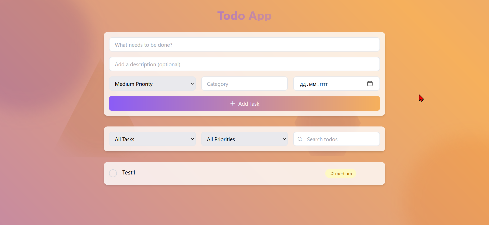

# Modern Todo App

A sophisticated todo application built with TypeScript, featuring a modern UI with animations, geometric backgrounds, and interactive elements.



## Features

- **Modern UI/UX**
  - Purple and gold gradient theme
  - Interactive geometric background shapes
  - Smooth animations and transitions
  - Glassmorphism effects
  - Responsive design

- **Task Management**
  - Create, edit, and delete tasks
  - Mark tasks as complete/incomplete
  - Set priority levels (Low, Medium, High)
  - Add categories and due dates
  - Add descriptions to tasks
  - Real-time filtering and search

- **Interactive Elements**
  - Background shapes follow cursor movement
  - Smooth hover animations
  - Delete animations
  - Edit mode with inline editing
  - Interactive buttons and controls

## Technologies Used

- **TypeScript** - Type-safe JavaScript
- **Tailwind CSS** - Utility-first CSS framework
- **Vite** - Next generation frontend tooling
- **Phosphor Icons** - Modern icon set
- **Web Components** - Native custom elements
- **Local Storage** - Persistent data storage

## Project Structure

```
/
├── src/
│   ├── components/
│   │   └── TodoList.ts      # Main todo component
│   ├── store/
│   │   └── todoStore.ts     # State management
│   ├── types/
│   │   └── todo.types.ts    # TypeScript interfaces
│   ├── main.ts             # Entry point
│   └── style.css          # Global styles
├── public/
│   └── vite.svg           # Static assets
└── index.html             # Main HTML file
```

## Getting Started

### Prerequisites

- Node.js (v14 or higher)
- npm (v6 or higher)

### Installation

1. Clone the repository:
   ```bash
   git clone <repository-url>
   cd web-to-do-app
   ```

2. Install dependencies:
   ```bash
   npm install
   ```

3. Start the development server:
   ```bash
   npm run dev
   ```

4. Open your browser and navigate to:
   ```
   http://localhost:5173
   ```

## Usage

### Adding Tasks
1. Enter task title in the input field
2. (Optional) Add description, category, and due date
3. Select priority level
4. Click "Add Task" or press Enter

### Managing Tasks
- Click the checkbox to toggle completion
- Use the edit button (pencil icon) to modify tasks
- Use the delete button (trash icon) to remove tasks
- Filter tasks using the status, priority, and search controls

### Editing Tasks
1. Click the edit button on any task
2. Modify the title and/or description
3. Press Enter to save or Escape to cancel
4. Click outside to save changes

## Custom Styling

The app uses a custom color scheme with purple and gold gradients:

```css
:root {
  --primary-purple: #8B5CF6;
  --primary-gold: #F6B05C;
  --secondary-purple: #6D28D9;
  --secondary-gold: #D4A017;
}
```

## Performance

- Optimized animations using CSS transforms
- Efficient DOM updates
- Local storage for data persistence
- Lazy loading of components

## Browser Support

- Chrome (latest)
- Firefox (latest)
- Safari (latest)
- Edge (latest)

## Contributing

1. Fork the repository
2. Create your feature branch (`git checkout -b feature/AmazingFeature`)
3. Commit your changes (`git commit -m 'Add some AmazingFeature'`)
4. Push to the branch (`git push origin feature/AmazingFeature`)
5. Open a Pull Request

## License

This project is licensed under the MIT License - see the LICENSE file for details.

## Acknowledgments

- Phosphor Icons for the beautiful icon set
- Tailwind CSS for the utility classes
- The Vite team for the excellent build tool
